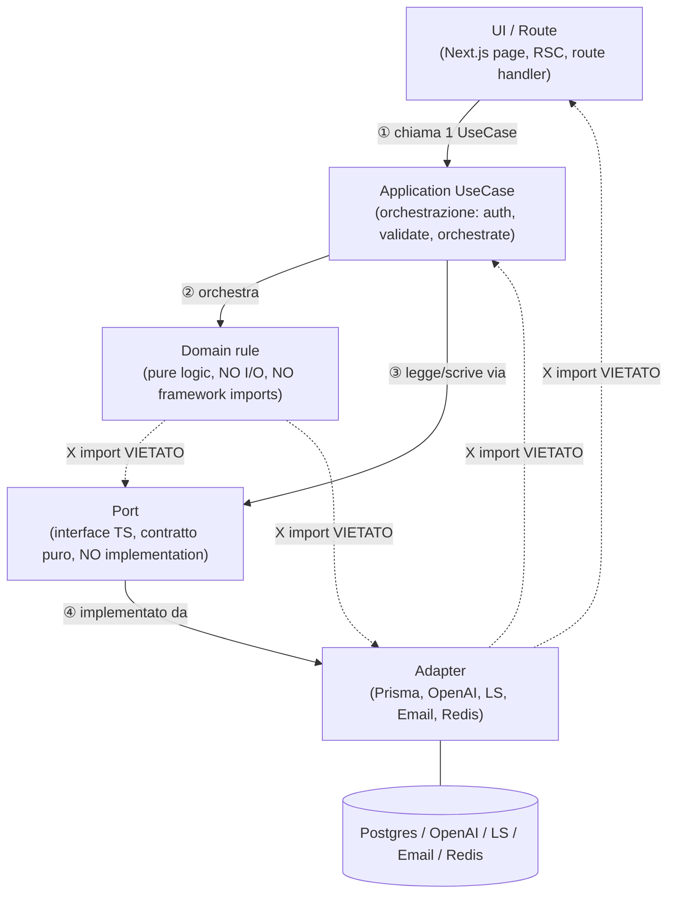

# ADR 0018 — V2 Ten-Domain Boundaries + Canonical Dependency Rule

**Status:** Accepted · 2026-07-16
**Deciders:** Platform architecture review
**Parent:** [ADR-0015 — Courssy naming canonical](0015-courssy-naming-decision.md), [ADR-0016 — Courssy monolith-modular](0016-courssy-monolith-modular.md)
**Supersedes:** [ADR-0016 §b nota — "Analytics consolidato come read-model in creator-ops/"](0016-courssy-monolith-modular.md) (re-elevates Analytics to a standalone V2 domain)
**Implements:** V2 monolith-modular strategy §1 (canonical dependency rule + domain map)

> **Decision (1-line):** Courssy V2 è organizzato in **10 domini** (Identity & Access, Catalog, Learning, Community, Messaging, Discovery, Creator Operations, Automation, Commerce, **Analytics**) con la regola di dipendenza canonica **`UI/Route → Application UseCase → Domain rule → Port → Adapter`**; la comunicazione cross-domain passa solo via UseCase orchestration, event grid, o un **bounded shared kernel** collocato in `src/lib/shared-kernel/`.

---

## Context

ADR-0016 ha fissato la V2 come **monolith-modular** con 9 domini e la regola canonica di dipendenza. Tuttavia:

1. **Analytics è stato collassato in creator-ops**: la nota in ADR-0016 §b dichiara che "Analytics" è un read-model dentro `src/domains/creator-ops/`. La V2 ha mostrato che cross-creator analytics (funnel, attribution, retention, conversion BI) richiede un dominio separato con i suoi read-models e contratti — non un singolo read-model embedded in creator-ops.
2. **Il master-plan originale Courssy §1 enumerava 10 domini** (separando Analytics). Questo ADR riconcilia i due documenti elevando Analytics a dominio standalone V2.
3. **La canonical dependency rule** (`UI → UseCase → Domain rule → Port → Adapter`) era già fissata in ADR-0016 §a ma non era stata resa **esplicita come decision point** con matrice di import + diagramma; questo ADR la eleva a decision autonoma, separandola dal più ampio ADR-0016 (che rimane il parent per il no-anticipatory-folders + 5-commit workflow).

---

## Decision

### (a) 10-domain map (replaces ADR-0016 §b 9-domain map)

| # | Domain | Responsibility (1-line) | V2 namespace (root) | Permitted deps |
|---|---|---|---|---|
| 1 | **Identity & Access** | Auth, users, ruoli, permessi, `AccessGrant` come single source of truth | `src/domains/identity/` | downstream only |
| 2 | **Catalog** | Products, courses, lessons, translations, asset delivery (PDF/audio/video) | `src/domains/catalog/` | downstream only |
| 3 | **Learning** | Progress, history, completions, notes, watchlist | `src/domains/learning/` | downstream only |
| 4 | **Community** | Posts, resources, future comments (V2 minimal) | `src/domains/community/` | downstream only |
| 5 | **Messaging** | Conversations user↔user, messages, notifications, **offer cards** | `src/domains/messaging/` | downstream only |
| 6 | **Discovery** | Feed rule-based (V2 MVP), recommendations, "continue watching" | `src/domains/discovery/` | downstream only |
| 7 | **Creator Operations** | Creator dashboard, audience, content mgmt, inbox | `src/domains/creator-ops/` | downstream only |
| 8 | **Automation** | Agents (draft-first), jobs, approvals, publishing, retry policy canonica | `src/domains/automation/` | downstream only |
| 9 | **Commerce** | Prices, checkout (Lemon Squeezy only), orders, coupons | `src/domains/commerce/` | downstream only |
| 10 | **Analytics** ★ NEW | Cross-creator events, attribution, conversion funnels, retention BI read-models | `src/domains/analytics/` | downstream only |

> **Nota**: Analytics è ora un dominio separato (non più read-model di creator-ops). La nota in ADR-0016 §b che lo collassava è esplicitamente invalidata da questo ADR; entrambi gli ADRs cross-linkgano la decisione.

### (b) Canonical Dependency Rule (5-layer stack, direzione obbligatoria)



### (c) Import-rule matrix (enforced by eslint-plugin-import + check:deps)

| From → To | Allowed | Forbidden except |
|---|---|---|
| UI/Route → Application UseCase | OK | |
| UI/Route → Domain rule | NO (UI chiama UseCase) | solo se UI = dedicated "domain-rule-runner" (admin tools) |
| UI/Route → Port | NO (no leak in UI) | |
| UI/Route → Adapter | NO | sempre vietato |
| Application UseCase → Domain rule | OK | |
| Application UseCase → Port | OK | |
| Application UseCase → Adapter | NO controverso | solo se Adapter triviale (es. logger) |
| Domain rule → UseCase / Port / Adapter | NO puro logic | |
| Port → Implementation | NO solo definition | |
| Adapter → Domain rule | OK legge Domain types | |
| Adapter → Application UseCase | NO Adapter invocato da UC | |
| Adapter → UI/Route | NO no upward leaks | |

**Eccezioni documentate:** vedi [ADR-0013 — Template-amish direct-import workaround](0013-template-amish-direct-import.md). Ogni eccezione futura richiede ADR analogo.

### (d) Cross-domain communication (3 meccanismi, mutuamente esclusivi)

I domini **non possono** importarsi l'un l'altro direttamente a livello di domain rule. Tre meccanismi ammessi per la comunicazione cross-domain:

1. **UseCase orchestration** (preferito): un UseCase in Domain A chiama un UseCase in Domain B **attraverso il suo port**. Esempio canonico (post-migration V2): **quando** una UseCase deve verificare che il viewer possieda un grant valido, **delega** la verifica a una UseCase del Domain Identity via il port esposto da Identity, **mai** importando direttamente la regola o l'adapter di Identity.
2. **Event grid** (async / eventual consistency): un UseCase in Domain A emette un evento; un UseCase in Domain B subscribe via il suo event-adapter. Lo schema evento è owned da Domain A. Backed by Postgres LISTEN/NOTIFY + Redis pub/sub per V2. La **taxonomy canonica** degli eventi + payload schemas è documentata in un Future ADR (event-grid ADR, TBD — non ancora scritto).
3. **Bounded shared kernel** (raro): due domini condividono un piccolo modulo immutabile di value-objects collocato in `src/lib/shared-kernel/`. Il shared kernel contiene **solo** types + pure constructors (no domain rules). Value-objects ammessi: `Money`, `Locale`, `ProductId`, `CreatorId`, `RecommendationScore`, `AgentRunStatus`, `OfferEligibility`, `ExternalOperationId`.

### (e) Inside-a-domain Import Rules

Dentro un singolo dominio, l'ordine è enforced da `eslint-plugin-import`:

- `route → usecase → rule → port → adapter`
- `rule → port`: forbidden
- `adapter → route`: forbidden
- `usecase → adapter`: forbidden (deve passare dal port)

### (f) Worked Example — Identity × Catalog

Uno user richiede una pagina protetta del catalogo:

1. **Route** (`src/app/catalog/page.tsx`): legge input, autentica user, chiama `getCatalogForUserUseCase`.
2. **UseCase** (`src/domains/catalog/usecase/get-catalog-for-user.ts`): chiama `useHasAccessUseCase(u, productId)` (Identity, via port); chiama `filterByLocaleRule(items, locale)` (Catalog, pure); legge items via `feedRepository.listFeedItems()` (Catalog port).
3. **Domain rule** (`src/domains/catalog/rules/filter-by-locale.ts`): pure function, no I/O.
4. **Port** (`src/domains/catalog/ports/feed-repository.ts`): `interface FeedRepository`.
5. **Adapter** (`src/domains/catalog/adapters/prisma-feed-repository.ts`): implementa il port via Prisma.

Il **route** non interroga mai Prisma direttamente. Il **domain rule** non importa il port. Il **catalog use case** non chiama l'OpenAI adapter direttamente — passa per `recommendation.policyRegistry.applyPolicies(...)`.

---

## Consequences

### Positive

- **Single-direction imports** rendono ogni module tracciabile al suo owner.
- **Hot-spot analysis** (master-plan §3) diventa banale: un file high-frequency che punta sideways è una boundary violation.
- **Migrazione a microservizi** (Phase 6+) è meccanica: un domain folder diventa un package; i port diventano IPC contracts.
- **Analytics elevata** a dominio separato sblocca V2 cross-creator funnels.

### Negative (accettati)

- **Overhead iniziale** per feature triviali (scrivere port + adapter per una Prisma call one-line).
- **Shared kernel** `src/lib/shared-kernel/` deve restare piccolo; drift qui ricrea la "Big Ball of Mud".
- **Cross-cutting concerns** (logging, telemetry, error formatting) vanno classificati una volta e collocati nel layer giusto.

### Neutral

- **ADR-0016 §b nota invalidata**: 9 domini → 10 domini. Cross-link aggiunto in entrambi gli ADRs.

---

## Cross-references

- **[ADR-0015 — Courssy naming canonical](0015-courssy-naming-decision.md)** — namespace V2 è `courssy/<domain>`.
- **[ADR-0016 — Courssy monolith-modular](0016-courssy-monolith-modular.md)** — parent: definisce 5-commit workflow + no-anticipatory-folders rule. **§b nota su Analytics è SUPERSEDED by this ADR**.
- **[ADR-0017 — Dependency policy](0017-dependency-policy.md)** — operationalizza la directional rule via `check:deps`.
- **[ADR-0014 — Atomicity boundary for Order+AccessGrant](0014-atomicity-boundary.md)** — Order ↔ AccessGrant canonicalmente nei domini Commerce + Identity.
- **[ADR-0013 — Template-amish direct-import workaround](0013-template-amish-direct-import.md)** — esempio canonico di eccezione boundary documentata.
- **[docs/architecture/001-db-migrations.md](../architecture/001-db-migrations.md)** — la migration policy vincola il DBA-side dei 10 domini.
- **[ARCHITECTURE.md](../../ARCHITECTURE.md)** — snapshot V1.x stack; V2 refactor avviene sotto questo snapshot.

---

## Quick reference

### Layer dependency matrix

| From ↓ → | UI/Route | UseCase | Domain rule | Port | Adapter |
|---|---|---|---|---|---|
| **UI/Route** | ✅ | ✅ | ❌ | ❌ | ❌ |
| **UseCase** | ❌ | ✅ | ✅ | ✅ | ❌ |
| **Domain rule** | ❌ | ❌ | ✅ | ❌ | ❌ |
| **Port** | ❌ | ❌ | ❌ | ✅ | ❌ |
| **Adapter** | ❌ | ❌ | ✅ (reads Domain types) | ❌ | ✅ |

*Legend:* ✅ allowed import; ❌ forbidden import; eccezioni documentate solo tramite ADR analogo a [ADR-0013](0013-template-amish-direct-import.md).

### Canonical folder shape (per domain)

```text
src/domains/<domain>/
  rules/<rule>.ts                 # Domain rule: pure logic, no I/O
  ports/<port>.port.ts            # Port: interface TS, no implementation
  adapters/<impl>.ts              # Adapter: Prisma, OpenAI, LS, Email, Redis
  usecases/<usecase>.usecase.ts   # Application UseCase: orchestration
src/app/<route>/page.tsx          # UI / Route: thin, calls one UseCase
```

### Worked example — Catalog domain

```text
src/domains/catalog/
  rules/filter-by-locale.ts
  ports/feed-repository.port.ts
  adapters/prisma-feed-repository.ts
  usecases/get-catalog-for-user.usecase.ts
src/app/catalog/page.tsx
```

Flow:
1. `src/app/catalog/page.tsx` calls `getCatalogForUserUseCase`.
2. `getCatalogForUserUseCase` calls `filterByLocaleRule` (Catalog rule) and `feedRepository.listFeedItems()` (Catalog port, implemented by Prisma adapter).
3. No layer imports upward or skips a layer.

## Verification

- **Scope**: this ADR is docs-only; no TypeScript surface under `src/` is touched.
- `npx tsc --noEmit` — must pass (any pre-existing drift is tracked separately).
- `npx vitest run` — must pass.
- `npm run lint` — must pass.
- `npm run check:naming` — must pass.
- `git grep -n "src/domains/creator-ops/.*analytics" -- src/` — da verificare prima del primo commit V2 che tocca Analytics (legacy uses under creator-ops/ possono ancora esistere; questo ADR non li rimuove).
- `wc -l docs/adr/0018-ten-domain-boundaries.md` — full-ADR shape (~290 LOC).

---

## Future work

1. **CI guardrail dependency rule**: implementare custom ESLint rule (`eslint-plugin-import` + `dependency-cruiser`) che fallisce la build se un layer importa da uno sbagliato secondo matrice §c. Blocker per il primo refactor V1.x → V2.
2. **Shared kernel extraction**: popolare `src/lib/shared-kernel/` con `Money`, `Locale`, `ProductId`, `CreatorId`, `RecommendationScore`, `AgentRunStatus`, `OfferEligibility`, `ExternalOperationId` come types + pure constructors. Un commit atomico per value-object.
3. `src/domains/analytics/` bootstrap: prima feature canonica = cross-creator funnel read-model (creato al primo evento reale che lo richiede).
4. **Event grid Future ADR** (TBD): canonizza nomi evento + payload schemas; gli eventi sono emessi dai UseCases via port-event-adapter. Reference number non assegnato — sarà l'ADR successivo ad ADR-0018.
5. `check:deps --rules=directional` (planned in ADR-0017): implementare la regola direzionale come failure (oggi è solo informativa).

---

## Implementation log

- **2026-07-16 (commit `90c843e`)**: ADR-0018 accettato. `docs/adr/0018-ten-domain-boundaries.md` + `docs/adr/0016-courssy-monolith-modular.md` committati via `docs(adr): 0016+0018 bidirezionale cross-link + honest verification scope`. Cross-link bidirezionale marcato in entrambi gli ADRs: ADR-0016 §b SUPERSEDED NOTICE + ADR-0018 §a nota esplicita.
- **2026-07-16 (fix-up commit, TBD-SHA)**: post-review cleanup di `90c843e`. Risolve (a) grammatica italiana §d point 1, (b) §Verification framing per evitare claim non-verificati, (c) ADR-0016 §b residuo forward-reference ("ADR-0017+" → ADR-0018 §a). Messaggio: `docs(adr): 0018 grammar + verification-scope + 0016 anchor`.
- **Pre-existing drift**: questo commit è docs-only e non include source modifications. Una `tsc --noEmit` eseguita su questo commit restituisce un fallimento pre-esistente in `src/domains/discovery/policies/policy-catalog.ts` (committed nel registry sprint, ~8120b82). Il drift è tracciato come follow-up separato; **non blocca** ADR-0018 perché ADR-0018 non modifica sorgenti.
- **Follow-up**: implementare custom ESLint dependency-cruiser rule (Future work §1).
- **Follow-up**: estrarre shared-kernel types (Future work §2) prima delle prime feature V2 cross-domain.
- **Follow-up**: bootstrap `src/domains/analytics/` (Future work §3) alla prima feature reale.
